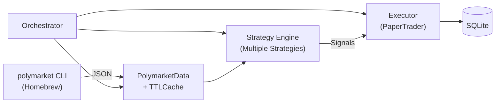

# Polymarket Agent

Agent-friendly auto-trading pipeline for Polymarket prediction markets.


## Features

- **Typed Python API** — wraps the Polymarket CLI into Pydantic v2 models (Market, Event, OrderBook, Price)
- **Pluggable strategy engine** — SignalTrader, MarketMaker, Arbitrageur, and AIAnalyst modules
- **Paper trading** — simulated order fills against real order-book data, logged to SQLite
- **CLI interface** — `run` (continuous loop), `tick` (single cycle), `status` (portfolio snapshot)
- **TTL cache** — in-memory per-key cache with configurable expiration on market data
- **YAML configuration** — mode selection, strategy params, and risk limits in a single `config.yaml`
- **Signal aggregation** — deduplication, confidence filtering, and cross-strategy consensus

## Architecture



The **Orchestrator** drives a fetch → analyze → execute cycle each tick. The **Data Layer** shells out to the `polymarket` CLI with `-o json` and parses responses into Pydantic models. **Strategies** consume market data and emit `Signal` objects. The **Executor** fills orders (paper or live) and persists trades to SQLite.

## Quick Start

### Prerequisites

- Python 3.12+
- [uv](https://docs.astral.sh/uv/) package manager
- [Polymarket CLI](https://github.com/Polymarket/polymarket-cli) (`brew install polymarket`)

### Install & run

```bash
git clone https://github.com/<your-username>/polymarket-agent.git
cd polymarket-agent
uv sync
```

Run a single trading tick:

```bash
uv run polymarket-agent tick
```

```
Markets: 42, Signals: 3, Trades: 2
Portfolio: $985.50 cash, $1002.30 total
```

## Usage

```bash
# Continuous trading loop (polls every 60s by default)
uv run polymarket-agent run

# Single fetch-analyze-execute cycle
uv run polymarket-agent tick

# Portfolio snapshot
uv run polymarket-agent status
```

All commands accept `--config` / `-c` (path to config file) and `--db` (path to SQLite database).

### Configuration

Edit `config.yaml` to change mode, strategy parameters, aggregation, and risk limits:

```yaml
mode: paper              # monitor | paper | live
starting_balance: 1000.0
poll_interval: 60

strategies:
  signal_trader:
    enabled: true
    volume_threshold: 10000
    price_move_threshold: 0.05
  arbitrageur:
    enabled: true
    price_sum_tolerance: 0.02
  ai_analyst:
    enabled: false
    model: claude-sonnet-4-6
    max_calls_per_hour: 20
    min_divergence: 0.15

aggregation:
  min_confidence: 0.5
  min_strategies: 1

risk:
  max_position_size: 100.0
  max_daily_loss: 50.0
  max_open_orders: 10
```

## Project Structure

```
src/polymarket_agent/
├── cli.py                  # Typer CLI entry point
├── config.py               # Pydantic config loading from YAML
├── orchestrator.py          # Main fetch → analyze → execute loop
├── db.py                   # SQLite persistence
├── data/
│   ├── client.py           # CLI wrapper (subprocess + JSON parsing)
│   ├── models.py           # Pydantic models (Market, Event, OrderBook, …)
│   └── cache.py            # In-memory TTL cache
├── strategies/
│   ├── base.py             # Strategy ABC + Signal dataclass
│   ├── signal_trader.py    # Volume/price-move signal strategy
│   ├── market_maker.py     # Bid/ask quoting around midpoint
│   ├── arbitrageur.py      # Price-sum deviation strategy
│   ├── ai_analyst.py       # Claude-based probability strategy
│   └── aggregator.py       # Signal dedup/filter/consensus
└── execution/
    ├── base.py             # Executor ABC + Portfolio/Order models
    └── paper.py            # Simulated fills with SQLite logging
```

## Development

```bash
# Run tests
uv run pytest tests/ -v

# Run tests with coverage
uv run pytest tests/ -v --cov=src/polymarket_agent

# Lint
ruff check src/

# Format
ruff format src/

# Type check (strict mode)
mypy src/
```

## Roadmap

| Phase | Status | Description |
|-------|--------|-------------|
| **1. Core Pipeline** | Done | CLI wrapper, data models, signal strategy, paper trading, orchestrator |
| **2. Advanced Strategies** | Done | MarketMaker, Arbitrageur, AIAnalyst, signal aggregation |
| **3. MCP Server** | Planned | Model Context Protocol integration for AI agent access |
| **4. Live Trading** | Planned | Real order placement via py-clob-client |

## Tech Stack

Python 3.12 · Pydantic v2 · Typer · SQLite · PyYAML · ruff · mypy · pytest
