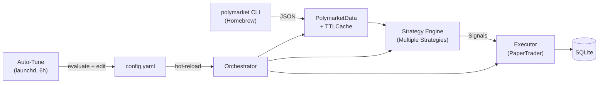
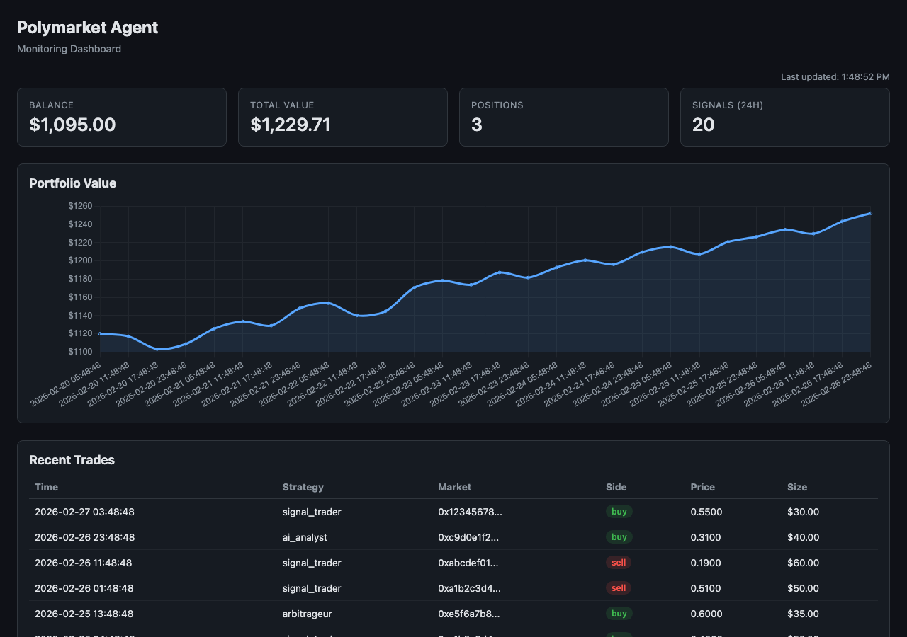

# Polymarket Agent

Agent-friendly auto-trading pipeline for Polymarket prediction markets.


## Features

- **Typed Python API** — wraps the Polymarket CLI into Pydantic v2 models (Market, Event, OrderBook, Price)
- **Pluggable strategy engine** — SignalTrader, MarketMaker, Arbitrageur, and AIAnalyst modules
- **Paper trading** — simulated order fills against real order-book data, logged to SQLite
- **Live trading** — real order placement via py-clob-client with private key signing
- **MCP server** — 22 tools for AI agent integration (market data, trading, signals, conditional orders, backtesting, monitoring)
- **Conditional orders** — stop-loss, take-profit, and trailing stop with auto-creation
- **Position sizing** — Kelly criterion, fractional Kelly, and fixed sizing methods
- **Backtesting** — historical CSV replay, performance metrics (Sharpe, drawdown, win rate, profit factor)
- **Automated strategy tuning** — periodic evaluation + Claude Code-driven config adjustments with config hot-reload
- **Monitoring & Dashboard** — structured JSON logging, alert webhooks, signal/portfolio tracking, web dashboard
- **CLI interface** — `run`, `tick`, `status`, `report`, `evaluate`, `backtest`, `dashboard`, `mcp` commands
- **TTL cache** — in-memory per-key cache with configurable expiration on market data
- **YAML configuration** — mode selection, strategy params, risk limits, and order management in `config.yaml`
- **Signal aggregation** — deduplication, confidence filtering, and cross-strategy consensus

## Architecture



The **Orchestrator** drives a fetch → analyze → execute cycle each tick, hot-reloading `config.yaml` when it detects changes. The **Data Layer** shells out to the `polymarket` CLI with `-o json` and parses responses into Pydantic models. **Strategies** consume market data and emit `Signal` objects. The **Executor** fills orders (paper or live) and persists trades to SQLite. The **Auto-Tune** loop periodically evaluates performance and invokes Claude Code to adjust strategy parameters.

## Quick Start

### Prerequisites

- Python 3.12+
- [uv](https://docs.astral.sh/uv/) package manager
- [Polymarket CLI](https://github.com/Polymarket/polymarket-cli) (`brew install polymarket`)

### Install & run

```bash
git clone https://github.com/<your-username>/polymarket-agent.git
cd polymarket-agent
uv sync
```

Run a single trading tick:

```bash
uv run polymarket-agent tick
```

```
Markets: 42, Signals: 3, Trades: 2
Portfolio: $985.50 cash, $1002.30 total
```

## Usage

### Core Trading Commands

```bash
# Continuous trading loop (polls every 60s by default)
uv run polymarket-agent run

# Single fetch-analyze-execute cycle
uv run polymarket-agent tick

# Portfolio snapshot
uv run polymarket-agent status
```

All commands accept `--config` / `-c` (path to config file) and `--db` (path to SQLite database).

### Live Trading

Live mode places real orders on Polymarket via [`py-clob-client`](https://github.com/Polymarket/py-clob-client). It requires an Ethereum private key and explicit opt-in via the `--live` flag.

```bash
# Install the live trading dependency
pip install polymarket-agent[live]

# Set config to live mode
# config.yaml: mode: live

# Run with explicit --live flag (required safety gate)
export POLYMARKET_PRIVATE_KEY=0xYOUR_PRIVATE_KEY
uv run polymarket-agent run --live
uv run polymarket-agent tick --live
```

Orders are placed as GTC (Good-Til-Cancelled) limit orders on the CLOB. If you use a Magic/proxy wallet, also set `POLYMARKET_FUNDER`.

### Strategies

Four pluggable strategies are available, each enabled independently in `config.yaml`:

**SignalTrader** — directional signals based on volume and price deviation from 0.50.

```yaml
strategies:
  signal_trader:
    enabled: true
    volume_threshold: 10000   # min 24h volume to consider a market
    price_move_threshold: 0.05 # min distance from 0.50 to emit a signal
```

Buys when the Yes price is below midpoint by more than the threshold, sells when above. Signal size is 1% of 24h volume. Confidence scales linearly with distance from midpoint.

**MarketMaker** — quotes bid/ask around the order book midpoint.

```yaml
strategies:
  market_maker:
    enabled: false
    spread: 0.05        # total spread width
    min_liquidity: 1000  # skip illiquid markets
    order_size: 50       # USDC per side
```

Fetches the live order book for each market, then emits a buy signal at `midpoint - spread/2` and a sell signal at `midpoint + spread/2`. Skips markets below `min_liquidity`.

**Arbitrageur** — exploits pricing inconsistencies (complementary outcome prices should sum to ~1.0).

```yaml
strategies:
  arbitrageur:
    enabled: true
    price_sum_tolerance: 0.02  # ignore deviations below this
    min_deviation: 0.03        # minimum deviation to trade
    order_size: 25             # USDC per trade
```

When the sum of outcome prices deviates from 1.0 beyond tolerance, buys the underpriced side (if sum < 1.0) or sells the overpriced side (if sum > 1.0). Confidence scales with deviation magnitude.

**AIAnalyst** — uses Claude to estimate market probabilities and trades on divergence.

```yaml
strategies:
  ai_analyst:
    enabled: false
    model: claude-sonnet-4-6
    max_calls_per_hour: 20   # rate limit
    min_divergence: 0.15     # min difference between AI estimate and market price
    order_size: 25.0         # USDC per trade
```

Sends each market's question and description to Claude, parses a probability from the response. If the estimate diverges from the market price by more than `min_divergence`, generates a buy or sell signal. Requires `ANTHROPIC_API_KEY`. Gracefully disabled when the key is not set.

**Signal Aggregation** — all strategy signals pass through an aggregation step before execution:

```yaml
aggregation:
  min_confidence: 0.5    # drop signals below this threshold
  min_strategies: 1      # require N strategies to agree on a market
```

Signals are deduplicated per market, filtered by confidence, and optionally require cross-strategy consensus.

### Risk Management

Every signal passes through a risk gate before execution:

```yaml
risk:
  max_position_size: 100.0  # max USDC per single trade
  max_daily_loss: 50.0      # stop trading after this daily loss
  max_open_orders: 10       # max concurrent open orders (live mode)
```

The risk gate runs once per tick and reuses a snapshot of daily loss and open order count across all signals in that tick. Rejected signals are logged but not executed.

### Conditional Orders

Automatic stop-loss, take-profit, and trailing stop orders that trigger when price conditions are met:

```yaml
conditional_orders:
  enabled: false
  default_stop_loss_pct: 0.10    # trigger sell if price drops 10%
  default_take_profit_pct: 0.20  # trigger sell if price rises 20%
  trailing_stop_enabled: false
  trailing_stop_pct: 0.05        # trail 5% below the high watermark
```

When enabled, the orchestrator automatically creates stop-loss and take-profit orders for every buy trade. Conditional orders are checked at the start of each tick before strategy analysis:

- **Stop-loss**: sells if bid drops to or below the trigger price
- **Take-profit**: sells if bid rises to or at the trigger price
- **Trailing stop**: tracks the highest price (high watermark) and sells if price drops below `high_watermark * (1 - trail_percent)`

Signals can also carry explicit `stop_loss` and `take_profit` prices that override the config defaults.

Conditional orders can be managed via MCP tools:
- `get_conditional_orders` — list all active conditional orders
- `cancel_conditional_order(order_id)` — cancel a specific order
- `create_conditional_order(...)` — manually create a conditional order

### Position Sizing

Three sizing methods control how much USDC is allocated per trade:

```yaml
position_sizing:
  method: fixed               # fixed | kelly | fractional_kelly
  kelly_fraction: 0.25        # fraction of full Kelly (fractional_kelly only)
  max_bet_pct: 0.10           # max % of portfolio per bet (kelly/fractional_kelly)
```

- **fixed** — uses the signal's original size (from the strategy)
- **kelly** — full Kelly criterion: `f* = (bp - q) / b` where `b = (1/price) - 1`, `p = confidence`, `q = 1 - p`. Capped at `max_bet_pct` of portfolio value
- **fractional_kelly** — `kelly_fraction * full Kelly`, also capped at `max_bet_pct`

The sizer runs after aggregation and before risk checks. It never increases beyond the signal's original size.

### Backtesting

Replay historical market data through the configured strategies to evaluate performance:

```bash
# Run backtest over a directory of CSV files
uv run polymarket-agent backtest data/sample/

# Filter by date range
uv run polymarket-agent backtest data/sample/ --start 2024-01-01 --end 2024-03-01

# Export results to JSON (optionally include individual trades)
uv run polymarket-agent backtest data/sample/ --output results.json --trades
```

**CSV format** — each file must have columns: `timestamp`, `market_id`, `question`, `yes_price`, `volume`, `token_id`. Multiple CSV files in the directory are merged.

```csv
timestamp,market_id,question,yes_price,volume,token_id
2024-01-01T00:00:00Z,abc123,Will it rain?,0.65,50000,0xtok1
2024-01-02T00:00:00Z,abc123,Will it rain?,0.70,55000,0xtok1
```

The engine replays data chronologically, running strategies at each time step and executing through a temporary PaperTrader. Output includes:

| Metric | Description |
|--------|-------------|
| Total return | Percentage gain/loss over the period |
| Sharpe ratio | Annualized risk-adjusted return |
| Max drawdown | Largest peak-to-trough decline |
| Win rate | Percentage of profitable round-trip trades |
| Profit factor | Gross profit / gross loss |
| Total trades | Number of trades executed |

```yaml
backtest:
  default_spread: 0.02      # synthetic orderbook spread for historical data
  snapshot_interval: 86400   # seconds between portfolio snapshots
```

The `run_backtest` MCP tool provides the same functionality for AI agents.

### Monitoring & Dashboard

Real-time observability into the agent's behavior with structured logging, alerts, and a web dashboard.



#### Structured Logging

Enable JSON-formatted log output for machine-readable log aggregation:

```yaml
monitoring:
  structured_logging: true
  log_file: logs/agent.log   # optional file output (in addition to console)
```

Each log line is a single JSON object:

```json
{"timestamp": "2026-02-27T00:30:00+00:00", "level": "INFO", "logger": "polymarket_agent.orchestrator", "message": "Executed 2 trades (mode=paper)"}
```

#### Alert Webhooks

Get notified on every trade execution via webhook (Slack, Discord, etc.):

```yaml
monitoring:
  alert_webhooks:
    - https://hooks.slack.com/services/T00/B00/XXXX
    - https://discord.com/api/webhooks/XXXX/XXXX
```

Alerts are also always logged to the console via the built-in `ConsoleAlertSink`. Each webhook receives a JSON POST with `{"text": "Trade executed: buy 25.00 USDC on abc123 (signal_trader)"}`.

#### Signal & Portfolio Tracking

The orchestrator automatically logs every signal and portfolio snapshot to SQLite:

- **Signal log** — records every signal with strategy, market, side, confidence, size, and status (`generated`, `executed`, `rejected`)
- **Portfolio snapshots** — records balance, total value, and positions at configurable intervals

```yaml
monitoring:
  snapshot_interval: 300   # seconds between portfolio snapshots (default 5 min)
```

Query via MCP tools:
- `get_signal_log(strategy?, limit?)` — retrieve logged signals, optionally filtered by strategy
- `get_portfolio_snapshots(limit?)` — retrieve portfolio value history
- `get_strategy_performance()` — per-strategy summary: signals generated, executed, and trade volume

#### Web Dashboard

A single-page web dashboard with real-time charts and tables:

```bash
# Install optional dependencies
pip install polymarket-agent[dashboard]

# Start the dashboard (defaults from config.yaml)
uv run polymarket-agent dashboard

# Override host/port via CLI flags
uv run polymarket-agent dashboard --host 127.0.0.1 --port 3000
```

```yaml
monitoring:
  dashboard_host: "0.0.0.0"  # bind address (used when --host not provided)
  dashboard_port: 8080        # port (used when --port not provided)
```

The dashboard includes:
- **Portfolio cards** — balance, total value, open positions, recent signal count
- **P&L chart** — portfolio value over time (Chart.js line chart, auto-refreshes every 15s)
- **Trades table** — recent trades with strategy, market, side, price, size
- **Signals table** — recent signals with strategy, confidence, execution status

**REST API endpoints** (all return JSON):

| Endpoint | Description |
|----------|-------------|
| `GET /api/health` | Agent version and status |
| `GET /api/portfolio` | Current balance, total value, positions |
| `GET /api/trades?limit=50` | Recent trades |
| `GET /api/signals?strategy=X&limit=100` | Signal log with optional strategy filter |
| `GET /api/snapshots?limit=100` | Portfolio value snapshots over time |

### Performance Reporting

Review trading performance with built-in analytics:

```bash
# Human-readable performance report
uv run polymarket-agent report --period 24h

# Machine-readable JSON report
uv run polymarket-agent report --period 7d --json
```

The `evaluate` command produces structured JSON designed for automated consumption:

```bash
# Structured evaluation for auto-tuning
uv run polymarket-agent evaluate --period 24h
```

The evaluate output includes: metrics (return, Sharpe, drawdown, win rate), per-strategy breakdown, trade analysis, current config, tunable parameters with min/max ranges, safety constraints, and a diagnostic summary.

### Auto-Tuning

The auto-tune pipeline periodically evaluates trading performance and invokes Claude Code to decide whether to adjust `config.yaml`. The trading loop hot-reloads config changes without restarting.

```
┌────────────────────────────────────┐
│ Trading Loop (tmux, 24/7)          │
│ polymarket-agent run               │
│  - each tick: check config mtime   │
│  - if changed: reload_config()     │
└──────────────────┬─────────────────┘
                   │ reads config.yaml
┌──────────────────┴─────────────────┐
│ config.yaml                        │
│  (edited by Claude Code)           │
└──────────────────┬─────────────────┘
                   │ writes
┌──────────────────┴─────────────────┐
│ Auto-Tune (launchd, every 6h)      │
│ scripts/autotune.sh                │
│  1. polymarket-agent evaluate      │
│  2. pipe JSON → claude -p          │
│  3. Claude edits config.yaml       │
└────────────────────────────────────┘
```

**Config hot-reload** — the `run` loop checks the config file's modification time before each tick. When a change is detected, the orchestrator rebuilds strategies, position sizer, and alert manager from the new config. The executor is preserved so positions remain in memory. Mode changes (e.g. paper → live) are rejected for safety.

**Setup auto-tuning:**

```bash
# Run manually
bash scripts/autotune.sh

# Or schedule via macOS launchd (every 6 hours)
cp scripts/com.polymarket-agent.autotune.plist ~/Library/LaunchAgents/
launchctl load ~/Library/LaunchAgents/com.polymarket-agent.autotune.plist
```

**Tuning rules** enforced by the auto-tune prompt:
- Never changes the `mode` field
- Adjusts at most 2–3 parameters per session
- Respects min/max ranges defined in tunable parameters
- Makes no changes if performance is acceptable (positive return, Sharpe > 0.5, win rate > 45%)

Logs are written to `logs/autotune/autotune-YYYYMMDD-HHMMSS.log`.

### MCP Server (AI Agent Integration)

The MCP server exposes 22 tools via stdio transport for AI agents:

```bash
uv run polymarket-agent mcp
```

| Category | Tools |
|----------|-------|
| **Market data** | `search_markets`, `get_market_detail`, `get_price_history`, `get_event`, `get_price`, `get_spread`, `get_volume`, `get_positions`, `get_leaderboard` |
| **Trading** | `get_portfolio`, `get_signals`, `refresh_signals`, `place_trade`, `analyze_market` |
| **Order management** | `get_conditional_orders`, `cancel_conditional_order`, `create_conditional_order` |
| **Backtesting** | `run_backtest` |
| **Monitoring** | `get_signal_log`, `get_portfolio_snapshots`, `get_strategy_performance` |
| **System** | `health_check` |

See `deploy/env.example` for all available environment variables.

### Environment Variables

| Variable | Purpose | Required |
|----------|---------|----------|
| `POLYMARKET_PRIVATE_KEY` | Wallet private key for live trading | Live mode only |
| `POLYMARKET_FUNDER` | Funder address for Magic/proxy wallets | Optional (live mode) |
| `ANTHROPIC_API_KEY` | API key for AIAnalyst strategy | AI features only |

See [`deploy/env.example`](deploy/env.example) for all available variables.

### Full Configuration Reference

```yaml
mode: paper              # monitor | paper | live
starting_balance: 1000.0
poll_interval: 60        # seconds between ticks in continuous mode

strategies:
  signal_trader:
    enabled: true
    volume_threshold: 10000
    price_move_threshold: 0.05
  market_maker:
    enabled: false
    spread: 0.05
    min_liquidity: 1000
    order_size: 50
  arbitrageur:
    enabled: true
    price_sum_tolerance: 0.02
    min_deviation: 0.03
    order_size: 25
  ai_analyst:
    enabled: false
    model: claude-sonnet-4-6
    max_calls_per_hour: 20
    min_divergence: 0.15
    order_size: 25.0

aggregation:
  min_confidence: 0.5
  min_strategies: 1

risk:
  max_position_size: 100.0
  max_daily_loss: 50.0
  max_open_orders: 10

conditional_orders:
  enabled: false
  default_stop_loss_pct: 0.10
  default_take_profit_pct: 0.20
  trailing_stop_enabled: false
  trailing_stop_pct: 0.05

position_sizing:
  method: fixed           # fixed | kelly | fractional_kelly
  kelly_fraction: 0.25
  max_bet_pct: 0.10

backtest:
  default_spread: 0.02
  snapshot_interval: 86400

monitoring:
  structured_logging: false
  log_file: null
  alert_webhooks: []
  snapshot_interval: 300
  dashboard_host: "0.0.0.0"
  dashboard_port: 8080
```

## Project Structure

```
scripts/
├── autotune.sh                    # Auto-tune cron script (evaluate → Claude Code → config edit)
└── com.polymarket-agent.autotune.plist  # macOS launchd schedule (every 6h)

src/polymarket_agent/
├── cli.py                  # Typer CLI entry point (run, tick, status, report, evaluate, …)
├── config.py               # Pydantic config loading from YAML + config_mtime()
├── orchestrator.py          # Main loop + config hot-reload
├── db.py                   # SQLite persistence
├── orders.py               # Conditional order models
├── position_sizing.py      # Kelly criterion position sizing
├── mcp_server.py           # MCP server (22 tools)
├── data/
│   ├── client.py           # CLI wrapper (subprocess + JSON parsing)
│   ├── models.py           # Pydantic models (Market, Event, OrderBook, …)
│   ├── provider.py         # DataProvider protocol
│   └── cache.py            # In-memory TTL cache
├── strategies/
│   ├── base.py             # Strategy ABC + Signal dataclass
│   ├── signal_trader.py    # Volume/price-move signal strategy
│   ├── market_maker.py     # Bid/ask quoting around midpoint
│   ├── arbitrageur.py      # Price-sum deviation strategy
│   ├── ai_analyst.py       # Claude-based probability strategy
│   └── aggregator.py       # Signal dedup/filter/consensus
├── backtest/
│   ├── historical.py       # CSV-based historical data provider
│   ├── engine.py           # Backtest engine (replay + execute)
│   └── metrics.py          # Performance metrics (Sharpe, drawdown, etc.)
├── monitoring/
│   ├── logging.py          # Structured JSON logging
│   └── alerts.py           # Alert sinks (console, webhook)
├── dashboard/
│   ├── api.py              # FastAPI HTTP API
│   └── static/dashboard.html  # Web dashboard UI
└── execution/
    ├── base.py             # Executor ABC + Portfolio/Order models
    ├── paper.py            # Simulated fills with SQLite logging
    └── live.py             # Real order placement via py-clob-client
```

## Development

```bash
# Run tests
uv run pytest tests/ -v

# Run tests with coverage
uv run pytest tests/ -v --cov=src/polymarket_agent

# Lint
ruff check src/

# Format
ruff format src/

# Type check (strict mode)
mypy src/
```

## Roadmap

| Phase | Status | Description |
|-------|--------|-------------|
| **1. Core Pipeline** | Done | CLI wrapper, data models, signal strategy, paper trading, orchestrator |
| **2. Advanced Strategies** | Done | MarketMaker, Arbitrageur, AIAnalyst, signal aggregation |
| **3. MCP Server** | Done | 22 MCP tools for AI agent integration |
| **4. Live Trading** | Done | Real order placement via py-clob-client, risk management |
| **5. Release & Deploy** | Done | v1.0.0, CI/CD, Docker, systemd |
| **6. Order Management** | Done | Stop-loss, take-profit, trailing stop, Kelly sizing |
| **7. Backtesting** | Done | Historical data replay, performance metrics, DataProvider protocol |
| **8. Monitoring** | Done | Dashboard, structured logging, alerts, signal/portfolio tracking |
| **9. Auto-Tuning** | Done | Config hot-reload, evaluate command, Claude Code-driven parameter tuning |

## Tech Stack

Python 3.12 · Pydantic v2 · Typer · SQLite · PyYAML · FastAPI · Chart.js · ruff · mypy · pytest
